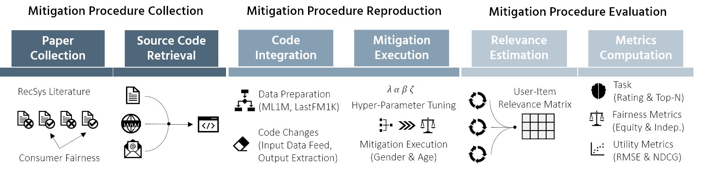
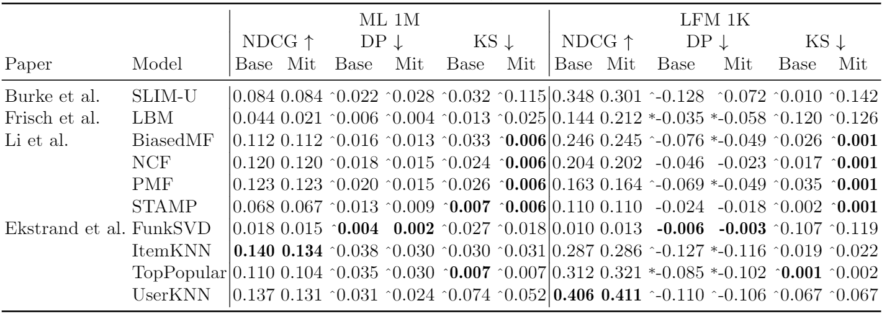
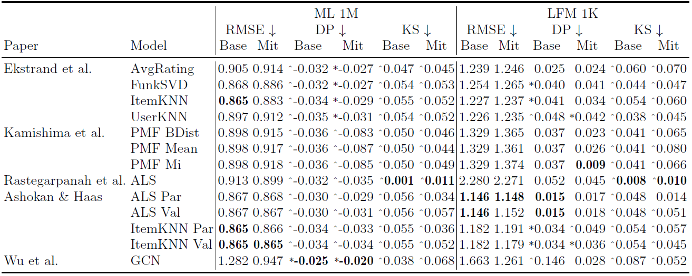
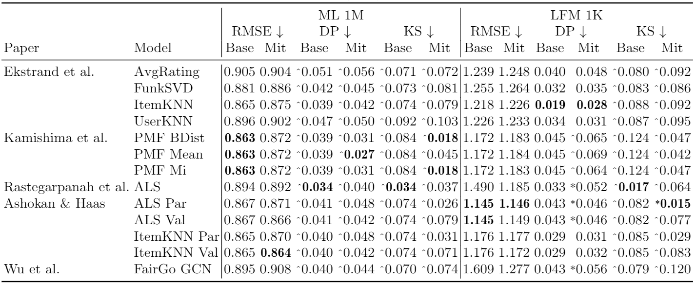

# Consumer Fairness in Recommender Systems: Contextualizing Definitions and Mitigations


This is the repository for the paper [*Consumer Fairness in Recommender Systems: Contextualizing Definitions and Mitigations*](https://doi.org/10.1007/978-3-030-99736-6_37),
developed by Giacomo Medda, PhD student at University of Cagliari, with the support of [Gianni Fenu](https://unica.it/unica/it/ateneo_s07_ss01.page?contentId=SHD30371),
Full Professor at University of Cagliari, [Mirko Marras](https://www.mirkomarras.com/), Non-tenure Track Assistant Professor at University of Cagliari,
and [Ludovico Boratto](https://www.ludovicoboratto.com/), Tenure Track Assistant Professor at University of Cagliari.

The goal of the paper was to find a common understanding and practical benchmarks on how and when each procedure of consumer
fairness in recommender systems can be used in comparison to the others.

If this repository is useful for your research, we would appreciate an acknowledgment by citing our [ECIR '22 paper](https://doi.org/10.1007/978-3-030-99736-6_37):
```
Boratto, L., Fenu, G., Marras, M., & Medda, G. (2022, April).
Consumer fairness in recommender systems: Contextualizing definitions and mitigations.
In: European Conference on Information Retrieval (pp. 552-566).
Cham: Springer International Publishing.
```

## Repository Organization

- ### [reproducibility_study](reproducibility_study)

  This is the directory that contains the source code of each reproduced paper identified by the author names of the respective paper.

    - **Ashokan and Haas**: *Fairness metrics and bias mitigation strategies for rating predictions*
    - **Burke et al**: *Balanced Neighborhoods for Multi-sided Fairness in Recommendation*
    - **Ekstrand et al**: *All The Cool Kids, How Do They Fit In. Popularity and Demographic Biases in Recommender Evaluation and Effectiveness*
    - **Frisch et al**: *Co-clustering for fair recommendation*
    - **Kamishima et al**: *Recommendation Independence*
    - **Li et al**: *User-oriented Fairness in Recommendation*
    - **Rastegarpanah et al**: *Fighting Fire with Fire. Using Antidote Data to Improve Polarization and Fairness of Recommender Systems*
    - **Wu et al**: *Learning Fair Representations for Recommendation. A Graph-based Perspective*
  
- ### [Preprocessing](Preprocessing)

  Contains the scripts to preprocess the raw datasets and to generate the input data for each reproduced paper.

- ### [Evaluation](Evaluation)

  Contains the scripts to load the predictions of each reproduced paper, compute the metrics and generate plots and tables
  in latex and markdown forms.

- ### Other Folders

  The other folders not already mentioned are part of the codebase that supports the scripts contained in [Preprocessing](Preprocessing)
  and [Evaluation](Evaluation).
  These directories and their contents are described by [README_codebase](README_codebase.MD), since the structure and code inside these
  folders is only used to support the reproducibility study and it is independent from the specific implementation of each paper.

## Reproducibility Pipeline
- ### [Code Integration](Preprocessing).
  The preprocessing of the raw datasets is performed by the scripts.
    - [preprocess_ml1m](Preprocessing/preprocess_ml1m.py): script to preprocess MovieLens 1M
    - [preprocess_lastfm1K](Preprocessing/preprocess_lastfm1K.py): script to preprocess Last.FM 1K
 
    The commands to preprocess each dataset are present at the top of the related dataset script, but the procedure is better
    described inside the [REPRODUCE.md](Preprocessing/REPRODUCE.md). The preprocessed datasets will be saved in [data/preprocessed_datasets](data/preprocessed_datasets).
 
    Once the MovieLens 1M and the Last.FM 1K dataset have been processed, we can pass to the generation of the input data
    for each reproduced paper:
    - [generate_input_data](Preprocessing/generate_input_data.py): script to generate the input data of each reproduced paper
    
    The commands to generate the input data for each preprocessed dataset and sensitive attribute are present at the top of
    the script, but the procedure is better described inside the [REPRODUCE.md](Preprocessing/REPRODUCE.md)). The generated
    input data will be saved in [Preprocessing/input_data](Preprocessing/input_data).

- ### [Mitigation Execution](reproducibility_study)

    Each paper (folder) listed in the subsection *reproducibility_study* of [Repository Organization](#repository-organization)
    contains a **REPRODUCE.md** file that describes everything to setup, prepare and run each reproduced paper. In particular,
    instructions to install the dependencies are provided, as well as the specific subfolders to fill with the input data
    generated in the previous step, in order to properly run the experiments of the selected paper. The procedure for each
    source code is better described in the already mentioned **REPRODUCE.md** file.

- ### [Relevance Estimation and Metrics Computation](Evaluation)

    The **REPRODUCE.md** file contained in each "paper" folder describes also where the predictions can be found at the end 
    of the mitigation procedure and guide the developer on following the instructions of the 
    [REPRODUCE.md](Evaluation/REPRODUCE.md) of **Evaluation** that contains:
    - `metrics_reproduced`: script that loads all the predictions of relevance scores and computes the metrics in form of
                            plots and latex tables
    This is the script that must be configured the most, since the paths of the specific predictions of each paper and
    model could be copied and pasted inside the script if the filenames do not correspond to what we expect and prepare.
    The [REPRODUCE.MD](Evaluation/REPRODUCE.md) already mentioned better described these steps and specifying which are the commands to execute to get the desired results.

## Installation

Considering the codebase and the different versions of libraries used by each paper, multiple Python versions are 
mandatory to execute properly this code. 

The codebase (that is the code not inside **reproducibility_study**, **Preprocessing**, **Evaluation**) needs a Python 3.8
installation and all the necessary dependencies can be installed with the [requirements.txt](requirements.txt) file in the
root of the repository with the following command in Windows:
```shell script
pip install -r requirements.txt
```
or in Linux:
```shell script
pip3 install -r requirements.txt
```

The installation of each reproducible paper is thoroughly described in the **REPRODUCE.md** that you can find in each paper
folder, but every folder contains a `requirements.txt` file that you can use to install the dependencies in the same way.
We recommend to use virtual environments at least for each reproduced paper, since some require specific versions
of Python (2, 3, 3.7) and a virtual environment for each paper will maintain a good order in the code organization.
Virtual environments can be created in different ways depending on the Python version and on the system. The
[Python Documentation](https://docs.python.org/3/library/venv.html) describes the creation of virtual environments for
Python >= 3.5, while the [virtualenv Website](https://virtualenv.pypa.io/en/latest/index.html) can be used for Python 2.

# Results

## Top-N Recommendation Gender


## Top-N Recommendation Age


## Rating Prediction Gender


## Rating Prediction Age


# Citation
